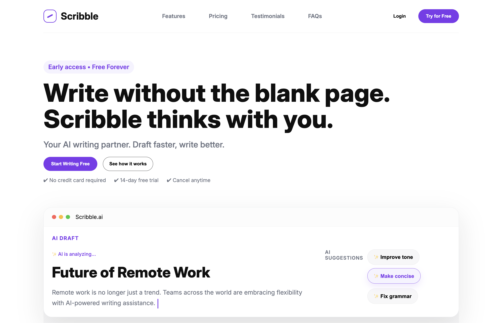

# Scribble

A modern landing page for an AI writing platform, built from scratch using HTML, CSS and JavaScript.

Scribble is designed around a clean, minimal interface that helps writers discover the product, understand how it works, explore pricing, and take action without unnecessary clutter.

This project was built to strengthen my understanding of responsive web design, CSS layouts, component-style thinking and building polished landing pages from scratch.

## Features

- Responsive landing page design
- Clean and minimal UI
- Modern navigation bar with CTA buttons
- Trusted companies / logo section
- Features section
- Three-step "How It Works" section
- Pricing section with monthly and yearly options
- Free, Pro and Team pricing cards
- Testimonials section
- FAQ section
- Call-to-action section
- Responsive footer with product, company and legal links
- Hover effects and subtle transitions
- Mobile-friendly layouts
- Responsive typography and spacing

## Built With

- HTML5
- CSS3
- Vanilla JavaScript

## Concepts Practiced
- Semantic HTML
- CSS Flexbox
- Responsive Web Design
- Media Queries
- CSS Grid and Flex layouts
- Typography and spacing
- Component-style CSS organization
- Hover effects and transitions
- Responsive navigation
- Responsive cards and sections
- Mobile-first layout adjustments
- FAQ interaction
- Landing page structure and visual hierarchy

## What I Learned

Building Scribble helped me understand that making a website look good is not just about writing more CSS. A lot of the work went into understanding spacing, sizing, alignment and how different sections behave at different screen sizes.

I also got more comfortable with Flexbox and responsive layouts, especially when dealing with sections that worked well on desktop but became cramped on smaller screens.

One of the biggest things I learned from this project was how much small layout decisions matter. Changing a width, gap, padding or flex direction can completely change how a section feels.

## Preview

## Application Link

## Future Improvements

- Add more interactive AI writing features
- Improve FAQ interactions
- Add functional authentication
- Connect pricing buttons to a real checkout flow
- Add backend functionality
- Add more animations and micro-interactions
- Improve accessibility
- Add dark mode
- Connect the landing page to a real SaaS application

## Author

Maverick